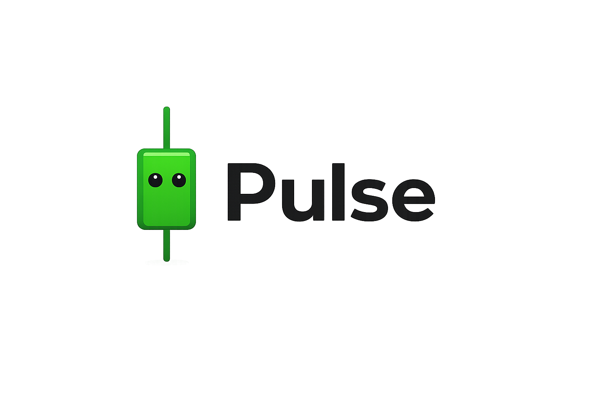

# Pulse — Design System

A design system for **Pulse**, a stocks product, inspired by [ElevenLabs](https://elevenlabs.io/brand)' visual language: a stark monochrome foundation, restrained typography, generous whitespace, and color used sparingly and meaningfully. We adapt that "research & engineering" calm to a finance product where numbers, density, and instant up/down legibility matter most.

---

## 1. Design Principles

ElevenLabs' aesthetic distilled, then translated to a stocks app:

1. **Monochrome first, color with intent.** Black, white, and neutral grays carry the interface. Color appears only where it conveys meaning — gains, losses, alerts. The chrome stays quiet so the data is loud.
2. **Authority through restraint.** Headlines use light weights and tight tracking, not big/bold mass. The product feels precise and engineered, not flashy.
3. **Whitespace is a feature.** Generous, consistent spacing. Let tables and charts breathe; avoid visual clutter.
4. **Numbers are the hero.** Tabular figures, monospaced where alignment matters, clear ▲/▼ semantics. Every price should be scannable in a glance.
5. **Accessible by default.** Target WCAG AA contrast everywhere. Never rely on color alone for up/down — pair it with a sign, arrow, or label.
6. **Light & dark are equal citizens.** A "trading floor" dark mode and a clean light mode share the same token structure.

---

## 2. Brand & Voice

**Name:** Pulse — a combination mark pairing the **Tick** candlestick glyph (the green K-line character) with a bold `Pulse` wordmark. See `assets/pulse-logo.png`.



**Positioning (one line):** Make every number instantly readable — a quiet interface, loud data.

**Personality:** Calm, precise, trustworthy, engineered. Pulse never shouts or hypes; it earns authority through restraint.

**Tone of voice:**
- Concise and direct — state facts, skip the exclamation marks (`AAPL +0.81%`, not "Soaring!").
- Neutral and objective — report up/down without nudging the user's decision.
- Speaks only when it matters — unusual moves, halts, risk notices.

**Logotype:** the `Pulse` wordmark set in a bold geometric sans, locked up to the right of the **Tick** candlestick mark with one mark-height of clear space between them. The candle's wick extends above and below the body; keep that vertical proportion intact. The mark may be used on its own (app icon, favicon, compact spaces); the wordmark should not appear without the mark in primary brand placements.

---

## 3. Mascot — Tick (小烛)

**Tick** is Pulse's mascot — and the green candlestick that anchors the logo. A single **candlestick** (K-line) character: the rounded body is the candle's real body, the wick is the line running through it, two dots are eyes. Born monochrome and geometric — the same visual language as the rest of the UI, with effectively zero illustration cost.

```
   │              │              │
  ┌┴┐            ┌┴┐            ╔╧╗
  │•‿•│   up →    │•◡•│   down → ║•︵•║   flat / halted →
  └┬┘   solid    └┬┘   hollow   ╚╤╝   gray, neutral
   │     (green)   │     (red)    │
```

**Why a candlestick:**
- **Native to the design language** — rectangles + lines, no complex art needed.
- **Changes color & form to express state** — solid-green-up, hollow-red-down, gray-flat map directly to the `--up` / `--down` / `--flat` tokens. The mascot literally visualizes the product.
- **Animatable** — subtle "breathing" or a blink on price ticks; a restrained nod to ElevenLabs' "sound flow" motion.
- **Reusable across states** — one expression set covers loading, empty, error, and achievement moments.

**Expression set:**
| State | Look | Use |
|-------|------|-----|
| Up | solid, `--up`, eyes ▲ / `‿` | strong gains, success |
| Down | hollow, `--down`, eyes `︵` | losses, errors |
| Flat | gray, `--flat`, eyes `◡` | neutral, idle |
| Searching | holds a magnifier | empty watchlist |
| Broken | wick snapped | error / data-loss page |

**Usage examples:**
- Empty state: Tick with a magnifier → "No tickers yet — search for one to start."
- Error page: Tick with a snapped wick → "Lost the data — fetching it back."
- Big rally: Tick goes solid-green, eyes turn ▲.

**Rules:** keep it monochrome + one semantic color at a time; never gradient or over-detail it; reserve expressive states for genuine moments (don't animate on every render). Respect `prefers-reduced-motion`.

---

## 4. Color

### 4.1 Neutral foundation (the monochrome core)

ElevenLabs builds on near-black/near-white with warm-tinted neutrals. We use a slightly cool, finance-appropriate gray ramp.

| Token | Light | Dark | Use |
|-------|-------|------|-----|
| `--bg`            | `#FFFFFF` | `#0A0A0B` | App background |
| `--surface`       | `#FAFAF9` | `#141416` | Cards, panels |
| `--surface-2`     | `#F4F4F3` | `#1C1C1F` | Nested panels, table header |
| `--border`        | `#E6E6E4` | `#2A2A2E` | Dividers, table grid lines |
| `--border-strong` | `#D2D2CF` | `#3A3A40` | Inputs, focus outline base |
| `--text`          | `#0A0A0B` | `#FAFAFA` | Primary text |
| `--text-secondary`| `#5C5C5C` | `#A0A0A6` | Labels, captions |
| `--text-muted`    | `#8A8A8A` | `#6B6B72` | Disabled, placeholders |

> The neutrals carry a faint warm tint in light mode (`#FAFAF9`, `#F4F4F3`) echoing ElevenLabs' `#fdfcfc`/`#f5f3f1` surfaces — softer than pure gray, less clinical.

### 4.2 Accent

A single restrained brand accent (used for primary actions, active states, focus, selected rows). Monochrome-adjacent so it never competes with semantic finance colors.

| Token | Value | Use |
|-------|-------|-----|
| `--accent`        | `#0A0A0B` (light) / `#FAFAFA` (dark) | Primary buttons, active nav — pure ink/paper, ElevenLabs-style |
| `--accent-soft`   | `#F0F0EF` (light) / `#26262B` (dark) | Hover/selected backgrounds |
| `--focus-ring`    | `#2563EB` | Keyboard focus outline (AA-visible on both themes) |

> Keep the *brand* accent monochrome (ink-on-paper). Reserve blue strictly for focus/interactive affordances so it never reads as "data."

### 4.3 Semantic — finance & status

Color is reserved for meaning. This is the one place we deliberately depart from pure monochrome.

| Token | Light | Dark | Meaning |
|-------|-------|------|---------|
| `--up`       | `#0E8A4F` | `#34D17F` | Price up / gain / positive |
| `--up-bg`    | `#E7F5EE` | `#0E2E1E` | Up cell/badge background |
| `--down`     | `#C8341E` | `#FF6B57` | Price down / loss / negative |
| `--down-bg`  | `#FBEAE7` | `#3A1410` | Down cell/badge background |
| `--flat`     | `--text-secondary` | `--text-secondary` | Unchanged |
| `--warning`  | `#B7791F` | `#F2B544` | Caution, halted, stale data |
| `--info`     | `#2563EB` | `#5B9DFF` | Informational |
| `--negative` | `#C8341E` | `#FF6B57` | Errors, destructive |
| `--positive` | `#0E8A4F` | `#34D17F` | Success/confirmation |

**Up/down convention:** Default to green-up / red-down (Western). Provide a user setting for red-up / green-down (East-Asian convention) and a colorblind-safe blue-up / orange-down palette. **Never encode direction with color alone** — always pair with `+`/`−` and `▲`/`▼`.

```
Colorblind-safe alt:  --up #1E6FD9 (blue)   --down #D9731E (orange)
```

---

## 5. Typography

Following ElevenLabs' split: a restrained display voice + a workhorse functional face. We avoid licensed `Waldenburg` and use accessible, finance-friendly defaults.

### 5.1 Font families

```css
--font-display: "Inter Tight", "Inter", system-ui, sans-serif;  /* headings */
--font-sans:    "Inter", system-ui, -apple-system, sans-serif;  /* UI & body */
--font-mono:    "JetBrains Mono", "SF Mono", ui-monospace, monospace; /* prices, tickers, code */
```

- **Display** (`Inter Tight`): headlines, page titles. Use **weight 300–400** with **negative tracking** for the ElevenLabs "authority through restraint" feel.
- **Functional** (`Inter`): all body text, labels, buttons, table cells. **Never** set display weights on body text.
- **Mono** (`JetBrains Mono`): every numeric value where alignment matters — prices, P/L, %, volumes, tickers. Enable tabular figures.

```css
/* Always-on for numbers */
font-variant-numeric: tabular-nums;
font-feature-settings: "tnum" 1, "cv01" 1;
```

### 5.2 Type scale

| Token | Size / Line | Weight | Tracking | Use |
|-------|-------------|--------|----------|-----|
| `display-xl` | 48 / 52 | 300 | -0.02em | Hero / marketing |
| `display-l`  | 36 / 40 | 300 | -0.02em | Page title |
| `h1`         | 28 / 34 | 400 | -0.015em | Section title |
| `h2`         | 22 / 28 | 500 | -0.01em | Card title |
| `h3`         | 18 / 24 | 500 | -0.005em | Subsection |
| `body`       | 15 / 22 | 400 | 0 | Default text |
| `body-sm`    | 13 / 18 | 400 | 0 | Secondary text |
| `label`      | 12 / 16 | 500 | 0.02em | Labels, table headers (often UPPERCASE) |
| `caption`    | 11 / 14 | 400 | 0.01em | Captions, footnotes |
| `num-l`      | 24 / 28 | 500 (mono) | 0 | Featured price |
| `num`        | 14 / 20 | 400 (mono) | 0 | Table numbers |

> Avoid overly tight or loose line-heights and letter spacing — consistency is part of the brand recognizability.

---

## 6. Spacing, Radius, Elevation

### 6.1 Spacing scale (4px base)

```
--space-0: 0     --space-1: 4px   --space-2: 8px   --space-3: 12px
--space-4: 16px  --space-5: 24px  --space-6: 32px  --space-7: 48px
--space-8: 64px  --space-9: 96px
```

Use generously. Default card padding `--space-5` (24px); page gutters `--space-6`+ on desktop.

### 6.2 Border radius

ElevenLabs leans soft-but-not-bubbly. Slightly tighter radii suit dense data.

```
--radius-sm: 6px    /* inputs, badges, table cells */
--radius-md: 10px   /* buttons, cards */
--radius-lg: 16px   /* panels, modals */
--radius-full: 9999px /* pills, avatars */
```

### 6.3 Elevation (shadows)

Subtle and low-spread; depth comes from borders and surface contrast more than heavy shadows.

```css
--shadow-sm: 0 1px 2px rgba(10,10,11,0.05);
--shadow-md: 0 4px 12px rgba(10,10,11,0.08);
--shadow-lg: 0 12px 32px rgba(10,10,11,0.12);
/* Dark mode: rely on --surface contrast + 1px border, minimize shadow */
```

---

## 7. Components

### 7.1 Buttons

| Variant | Light | Dark | Use |
|---------|-------|------|-----|
| **Primary** | bg `--accent` (#0A0A0B), text white | bg #FAFAFA, text #0A0A0B | Main action (Buy, Confirm) |
| **Secondary** | bg `--surface`, 1px `--border-strong`, text `--text` | same pattern | Default action |
| **Ghost** | transparent, text `--text`, hover `--accent-soft` | same | Toolbar, low-emphasis |
| **Buy** | bg `--up`, text white | bg `--up`, dark text | Order entry |
| **Sell** | bg `--down`, text white | bg `--down`, dark text | Order entry |
| **Destructive** | bg `--negative`, text white | same | Cancel order, delete |

- Height: `sm 32px`, `md 40px`, `lg 48px`. Radius `--radius-md`.
- Padding x: 16px (md). Font: `label`/`body-sm`, weight 500.
- States: hover = 4% darken/soften; active = 8%; disabled = `--text-muted` + 40% opacity; focus = 2px `--focus-ring` offset 2px.

### 7.2 Data tables (the core surface)

- **Header:** `--surface-2` bg, `label` style, UPPERCASE, `--text-secondary`, sticky on scroll.
- **Rows:** 40–44px height, 1px `--border` bottom divider. Hover row → `--accent-soft`. Zebra striping optional and very subtle (`--surface` alt).
- **Numeric columns:** right-aligned, `--font-mono`, `tabular-nums`. Gains/losses in `--up`/`--down` with sign + arrow.
- **Density toggle:** comfortable (44px) / compact (32px).
- **Sticky first column** (ticker/name) for horizontal scroll.

```
AAPL   228.52  ▲ +1.84  +0.81%      ← --up
TSLA   241.10  ▼ −3.22  −1.32%      ← --down
```

### 7.3 Price / change display

```
Featured:  num-l mono, bold price
           [▲ +1.84  +0.81%] badge: --up text on --up-bg, radius-sm, 2px/8px padding
```

- Always show: absolute change, percent change, direction glyph.
- Stale/delayed data: append `--warning` dot + tooltip ("Delayed 15 min").

### 7.4 Charts

- **Palette:** monochrome line/area by default (`--text` line, faint `--accent-soft` fill). Direction color (`--up`/`--down`) applied based on period performance.
- **Gridlines:** `--border`, 1px, low contrast. Axis labels `caption` / `--text-muted`.
- **Candlesticks:** up = `--up`, down = `--down`; hollow/filled bodies per convention.
- **Crosshair / tooltip:** dark surface card, mono numbers, follows cursor.
- **Sparklines** in tables: 1px stroke, colored by net change, no axes.
- Echo ElevenLabs' "sound flow" motif subtly: smooth, organic curves for area charts; precise, gridded structure for the frame.

### 7.5 Cards / panels

- bg `--surface`, 1px `--border`, radius `--radius-lg`, padding `--space-5`, `--shadow-sm`.
- Card title `h2`/`h3`; optional `--text-secondary` subtitle; action affordances top-right, ghost buttons.

### 7.6 Inputs & forms

- bg `--bg`, 1px `--border-strong`, radius `--radius-sm`, height 40px, `body` text.
- Focus: border `--focus-ring` + 2px ring. Error: border `--negative` + helper text.
- Search (ticker lookup): leading magnifier icon, mono results, keyboard-navigable dropdown.

### 7.7 Badges & status

- Pill, `--radius-full`, `caption`/`label`, 2px/8px padding.
- Market status: Open (`--positive`), Closed (`--text-muted`), Pre/After (`--warning`), Halted (`--negative`).

### 7.8 Navigation

- Top bar: `--bg`/`--surface`, 1px bottom `--border`, ticker search center, account right.
- Side nav: ghost items, active = `--accent-soft` bg + `--text`, 3px left accent bar.

---

## 8. Iconography & Motion

- **Icons:** thin, consistent stroke (1.5px), geometric (e.g. Lucide). Match the "engineered" tone.
- **Direction glyphs:** ▲ ▼ for price moves; reserve filled triangles for direction, outline chevrons for navigation.
- **Motion:** subtle and quick. Transitions 120–200ms `ease-out`. Number changes can flash `--up-bg`/`--down-bg` briefly on tick update (≤400ms), then fade — never distracting. Respect `prefers-reduced-motion`.

---

## 9. Theming Implementation

Token-driven, theme via `[data-theme]` attribute. Single source of truth → CSS variables (and/or a Tailwind config / TS token export).

```css
:root, [data-theme="light"] {
  --bg:#FFFFFF; --surface:#FAFAF9; --surface-2:#F4F4F3;
  --border:#E6E6E4; --text:#0A0A0B; --text-secondary:#5C5C5C;
  --up:#0E8A4F; --down:#C8341E; /* …full set above… */
}
[data-theme="dark"] {
  --bg:#0A0A0B; --surface:#141416; --surface-2:#1C1C1F;
  --border:#2A2A2E; --text:#FAFAFA; --text-secondary:#A0A0A6;
  --up:#34D17F; --down:#FF6B57; /* … */
}
```

User-configurable: theme (light/dark/system), up-down color convention (green-up / red-up / colorblind-safe), density (comfortable/compact).

---

## 10. Accessibility Checklist

- [ ] Text contrast ≥ 4.5:1 (AA); large text ≥ 3:1.
- [ ] Up/down never conveyed by color alone — sign + arrow + (optional) label.
- [ ] Colorblind-safe palette option ships from day one.
- [ ] All interactive elements keyboard reachable; visible `--focus-ring`.
- [ ] `prefers-reduced-motion` disables tick flashes and chart animations.
- [ ] Numbers use `tabular-nums` for stable scanning.
- [ ] Tables have proper `<th scope>`, sortable headers announce state.

---

## 11. Quick Reference (do / don't)

**Do**
- Keep chrome monochrome; spend color on data meaning.
- Use light-weight, tightly-tracked display type for titles.
- Right-align and monospace all numbers.
- Give the layout room to breathe.

**Don't**
- Add gradients/neon to the UI chrome (save expressive color for charts/marketing).
- Use bold display weights for body or buttons.
- Encode gains/losses with color only.
- Crowd tables — prefer density toggle over shrinking everything.

---

*Sources & inspiration: [ElevenLabs Brand](https://elevenlabs.io/brand) · [ElevenLabs Guidelines](https://11labs-guides-dev.a17.dev/) · [Design analysis](https://getdesign.md/elevenlabs/design-md) · [Fonts in Use](https://fontsinuse.com/uses/62065/elevenlabs-website). Adapted for Pulse — monochrome foundation and restrained typography from ElevenLabs, with finance-specific semantics (up/down, tabular data, charts) and the Tick (小烛) candlestick mascot added.*
